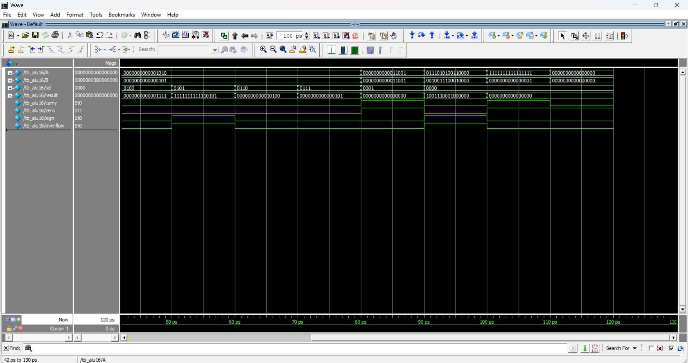

# 16-bit ALU Design using Verilog

## 📌 Overview
This project implements a 16-bit Arithmetic Logic Unit (ALU) using Verilog HDL. The ALU performs arithmetic, logical, and shift operations and generates status flags.

## ⚙️ Operations
- Addition
- Subtraction
- AND
- OR
- XOR
- NOT
- Shift Left
- Shift Right

## 🚩 Flags
- Carry
- Zero
- Sign
- Overflow

## 🧠 Design Details
- Structural modeling using Full Adders
- Ripple Carry Adder (16-bit)
- Behavioral ALU control using case statements

## 🧪 Simulation
- Verified using testbench
- Waveform analysis included

## 🛠 Tool Used
- ModelSim

## 📷 Output Waveform

